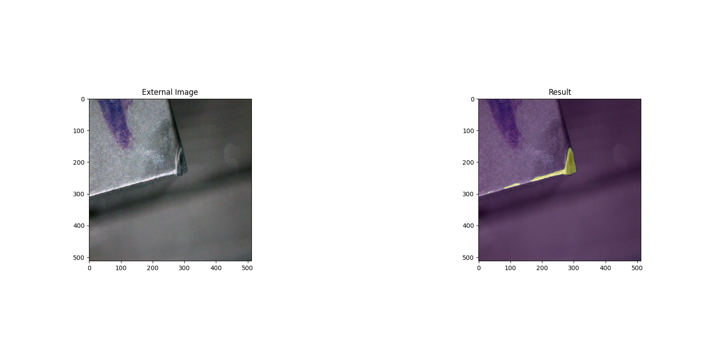

# *Wear measurement*

### Requirements for the important packages
------
------
* keras: Version 2.8.0
* numpy: Version 1.19.5 
* pillow: Version 8.4.0
* python: Version 3.8.10
* matplotlib: Version 3.5.1
* scikit-learn: Version 1.0.2
* tensorflow-gpu: Version 2.4.0 
or
* tensorflow: Version 2.4.0 
* opencv-python: Version 4.5.4.58


### Explanation
------
------
##### Camera implementation script
In this script the camera is calibrated and the data set for image analysis is created.

##### Tool classification script
In the script tool classification the neural network is trained to classify the tool. In the end, the trained model is obtained and the tools can be classified.

##### Wear measurement script
In the Wear measurement script, the recorded data set can be extended for training. Further the network can be trained. At the end of the training, the pre-trained model for Semantic Segmentation is obtained. After that the wear of the parts can be measured.

### Usage
------
------
##### Setup
For comfortable work install ConEmu https://conemu.github.io/ for Powershell. You can two tabs in one with hotkeys open 
-   Strg + Shift + e
    or
-   Strg + Shift + o

1. Create a virtual environment
```sh
python -m venv env_wear_measurement
```

2. Activate the virtual environment
```sh
./env_wear_measurement/Scripts/activate
```

3. Install python packages
```sh
pip install keras==2.8.0
pip install numpy==1.19.5 
pip install pillow==8.4.0
pip install matplotlib==3.5.1
pip install scikit-learn==1.0.2
pip install tensorflow-gpu==2.4.0 
pip install opencv-python==4.5.4.58
```

4. Clone the project from https://github.com/iusav/wear_measurement
```sh
git clone https://github.com/iusav/wear_measurement.git
```
If you want to clone a specific branch run, e.g.    
```sh
git clone https://github.com/iusav/wear_measurement.git -b fabian_kohnle
```

5. Install VS Code for development
6. Open the "wear_measurement" project on VS Code

### Python Script
------
------
##### **Camera implementation script**

##### *calibration.py*
* Access camera
* Crop the window to 960x960 pixels
* When starting the program, the window with the camera section opens
* Place the "Calibration Target" of the Dino-Lite microscope on the wear surface.
* Take a picture with the "k" key
* Mark distance (keep mouse button pressed)
* Output the number of pixels between the distance
* To close all windows press "Esc" for at least 1 sec.
```sh
$ python calibration.py
```

##### *camera_wear_measurement.py*
```sh
$ python camera_wear_measurement.py
```

##### *camera_tool_classification.py*
* Enter value from calibration.py in `calibration= ...`.
* Load stored (trained) model
```
model = tf.keras.models.load_model('Name')
```
* Image section opens
* Capture image with "k
* Evaluation appears (wear surface is displayed in the console)
* When closing the evaluation a new window appears where it is possible to measure the wear mark width manually, if wanted
* Closing the window leads to a new start of the measurements (end of the wear measurement by holding down the Esc key)
```sh
$ python camera_tool_classification.py
```

##### **Tool classification script**
##### *tool_class_training.py*
* Run program further (Training)
```sh
$ python tool_class_training.py
```

##### *tool_class_evaluation.py*
* Enter the file path of the image (Enter Filepath:)
* Load saved model
```
loaded_model = tf.keras.models.load_model('Modellname')
```
* Prediction evaluation (Plot)
```sh
$ python tool_class_evaluation.py
```

| Wendeschneidplatte | Schaftfräser | Wendeschneidplatte |
| --- | --- | --- |
|  |  |  |

##### **Wear measurement script** 

##### *U_Net_Model.py*
* Defining the U-Net model

##### *segmentation_training.py*
* Loading the images from the folder where the original images are located
* Data augmentation
* U-Net Modell loading
* Modell Training
```sh
$ python segmentation_training.py
```
* Saving results of the model
```
model.save('Name')
```
* Evaluation of the training process (Accuracy/Loss)
* Calculation of IoU score

##### *segmentation_evaluation.py*
* Loading a saved model
```
model = tf.keras.models.load_model('Name')
```
```sh
$ python segmentation_evaluation.py
```
* Loading image to be evaluated
```
test_img_other = cv2.imread("C:/.../.../Verschleissbild")
```

* If desired: A manually created mask can be loaded to compare the prediction with the real wear surface (IoU score). 
* Plotting of the results

| Input --> Output |
| --- | 
|  | 
| --- | 
|  | 
| --- | 
|  | 